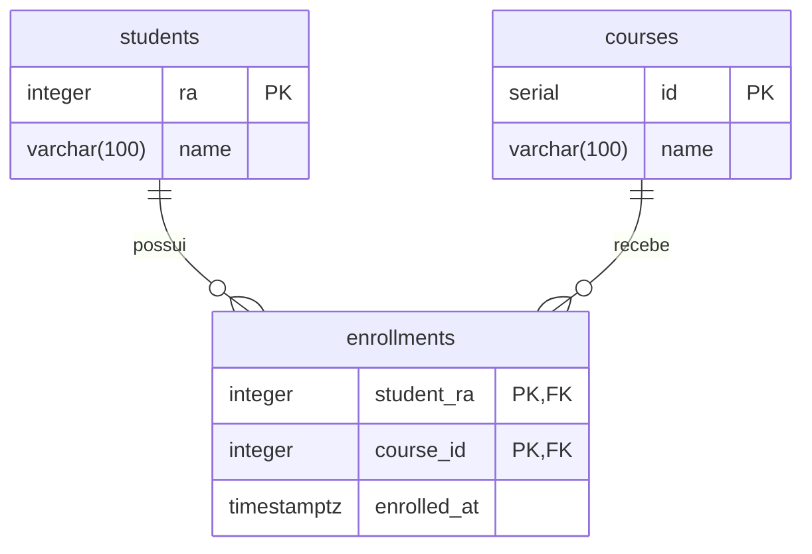

# API REST desenvolvida com NestJS e Drizzle ORM

A API REST permite cadastrar estudantes e cursos e registrar matrículas, relacionando um estudante a um curso.




## Estrutura

```text
.
├── .env                    # Configuração compartilhada, mantida na raiz
├── .env.example            # Modelo de configuração
├── compose.yml             # Serviços server e postgres
├── postgres/
│   ├── Dockerfile
│   └── init.sql             # Criação das tabelas
└── server/
    ├── Dockerfile
    ├── package.json
    └── src/
        ├── database/        # Conexão com o PostgreSQL
        └── modules/         # Estudantes, cursos e matrículas
```


## Configuração do ambiente

Caso ainda não exista um `.env`, copie o modelo:

```bash
cp .env.example .env
```

Mantenha o `.env` na raiz e configure as variáveis:

| Variável | Finalidade | Exemplo |
| --- | --- | --- |
| `API_PORT` | Porta da API publicada pelo Docker no computador | `3002` |
| `PORT` | Porta em que o NestJS escuta | `3000` |
| `POSTGRES_DB` | Nome do banco | `escola` |
| `POSTGRES_USER` | Usuário do banco | `app` |
| `POSTGRES_PASSWORD` | Senha do banco | Defina uma senha local |
| `PGHOST` | Endereço do banco na rede do Compose | `postgres` |
| `PGPORT` | Porta interna do PostgreSQL | `5432` |
| `PGPORT_HOST` | Porta do banco publicada no computador | `5433` |

O Compose fornece ao servidor as credenciais `POSTGRES_*` como `PGDATABASE`, `PGUSER` e `PGPASSWORD`. Na execução local, o servidor lê o `.env` da raiz e também aceita as credenciais `POSTGRES_*`.

Mantenha `PGPORT=5432` nesta configuração: o contêiner do PostgreSQL usa essa porta. Para mudar a porta de acesso pelo computador, altere `PGPORT_HOST`.

## Subir a aplicação com Docker Compose

Construa/inicie os serviços em segundo plano:

```bash
docker compose up -d --build
```

O servidor aguarda o healthcheck do PostgreSQL antes de iniciar. Acompanhe o estado e os logs:

```bash
docker compose ps
docker compose logs -f server postgres
```

Use `Ctrl+C` para sair do acompanhamento dos logs; os serviços continuam em execução.

Com as portas do exemplo:

- API: `http://localhost:3002`.
- PostgreSQL acessível pelo computador: `localhost:5433`.
- PostgreSQL acessível pelo servidor no Compose: `postgres:5432`.

Para parar e remover os contêineres, preservando os dados do banco:

```bash
docker compose down
```

Os dados ficam no volume `postgres_data`. O arquivo `postgres/init.sql` é executado na primeira inicialização de um banco vazio; alterações posteriores nesse arquivo não são aplicadas automaticamente a um volume existente.


## Rotas disponíveis

Todas as rotas de estudantes, cursos e matrículas possuem o prefixo `/api`. Não há rota cadastrada para `/`.

| Método | Rota | Operação |
| --- | --- | --- |
| POST | `/api/students` | Criar estudante |
| GET | `/api/students` | Listar estudantes |
| GET | `/api/students/:ra` | Buscar estudante pelo RA |
| PATCH | `/api/students/:ra` | Atualizar nome do estudante |
| DELETE | `/api/students/:ra` | Excluir estudante |
| POST | `/api/courses` | Criar curso |
| GET | `/api/courses` | Listar cursos |
| GET | `/api/courses/:id` | Buscar curso pelo ID |
| PATCH | `/api/courses/:id` | Atualizar nome do curso |
| DELETE | `/api/courses/:id` | Excluir curso |
| POST | `/api/enrollments` | Criar matrícula |
| GET | `/api/enrollments` | Listar matrículas |
| GET | `/api/enrollments/student/:studentRa/course/:courseId` | Buscar matrícula |
| DELETE | `/api/enrollments/student/:studentRa/course/:courseId` | Excluir matrícula |

## Testar todas as rotas com curl

Execute os exemplos na ordem apresentada, no mesmo terminal. A opção `-i` mostra o status HTTP e os cabeçalhos da resposta. Os comandos de criação e exclusão alteram os dados do banco.

Defina a URL e um RA ainda não cadastrado:

```bash
BASE_URL=http://localhost:3002
STUDENT_RA=2026001
```

Se alterar `API_PORT`, ajuste `BASE_URL`.

### 1. Estudantes: criar, listar, buscar e atualizar

Criar estudante (`201 Created`):

```bash
curl -i -X POST "$BASE_URL/api/students" \
  -H 'Content-Type: application/json' \
  -d "{\"ra\":$STUDENT_RA,\"name\":\"Ana Silva\"}"
```

Listar estudantes (`200 OK`):

```bash
curl -i "$BASE_URL/api/students"
```

Buscar pelo RA (`200 OK`):

```bash
curl -i "$BASE_URL/api/students/$STUDENT_RA"
```

Atualizar o nome (`200 OK`):

```bash
curl -i -X PATCH "$BASE_URL/api/students/$STUDENT_RA" \
  -H 'Content-Type: application/json' \
  -d '{"name":"Ana Souza"}'
```

### 2. Cursos: criar, listar, buscar e atualizar

Criar curso (`201 Created`):

```bash
curl -i -X POST "$BASE_URL/api/courses" \
  -H 'Content-Type: application/json' \
  -d '{"name":"Desenvolvimento Web III"}'
```

A resposta contém o `id` gerado pelo banco. Defina `COURSE_ID` com esse valor antes de continuar. O exemplo abaixo pressupõe que a resposta retornou `"id":1`:

```bash
COURSE_ID=1
```

Listar cursos (`200 OK`):

```bash
curl -i "$BASE_URL/api/courses"
```

Buscar pelo ID (`200 OK`):

```bash
curl -i "$BASE_URL/api/courses/$COURSE_ID"
```

Atualizar o nome (`200 OK`):

```bash
curl -i -X PATCH "$BASE_URL/api/courses/$COURSE_ID" \
  -H 'Content-Type: application/json' \
  -d '{"name":"Desenvolvimento Web Avancado"}'
```

### 3. Matrículas: criar, listar e buscar

O estudante e o curso precisam existir. A combinação de RA e ID do curso identifica a matrícula; não existe um ID separado nem uma rota PATCH para matrículas.

Criar matrícula (`201 Created`):

```bash
curl -i -X POST "$BASE_URL/api/enrollments" \
  -H 'Content-Type: application/json' \
  -d "{\"studentRa\":$STUDENT_RA,\"courseId\":$COURSE_ID}"
```

A resposta inclui `studentRa`, `courseId` e `enrolledAt`, preenchido automaticamente pelo banco.

Listar matrículas (`200 OK`):

```bash
curl -i "$BASE_URL/api/enrollments"
```

Buscar a matrícula (`200 OK`):

```bash
curl -i "$BASE_URL/api/enrollments/student/$STUDENT_RA/course/$COURSE_ID"
```

### 4. Excluir matrícula, estudante e curso

Remova primeiro a matrícula, pois as chaves estrangeiras impedem excluir estudantes ou cursos que ainda tenham matrículas vinculadas. Se houver outros vínculos, remova-os também antes de excluir os registros.

Excluir matrícula (`200 OK`):

```bash
curl -i -X DELETE "$BASE_URL/api/enrollments/student/$STUDENT_RA/course/$COURSE_ID"
```

Excluir estudante (`200 OK`):

```bash
curl -i -X DELETE "$BASE_URL/api/students/$STUDENT_RA"
```

Excluir curso (`200 OK`):

```bash
curl -i -X DELETE "$BASE_URL/api/courses/$COURSE_ID"
```

As exclusões retornam um objeto JSON com a propriedade `message`.

## Validações e respostas de erro

- Nomes devem ser strings com 3 a 100 caracteres.
- O RA e os identificadores enviados na criação de matrículas devem ser números inteiros positivos em JSON, sem aspas.
- As colunas de RA e IDs são `INTEGER`; utilize valores até `2147483647`. Os DTOs ainda não validam esse limite máximo.
- A atualização de estudantes e cursos aceita somente `name`, que é opcional.
- Campos extras no corpo da requisição são rejeitados (`400 Bad Request`).
- Parâmetros de rota que não são inteiros são rejeitados (`400 Bad Request`).
- Busca individual, atualização ou exclusão de registro inexistente retorna `404 Not Found`.
- Uma matrícula já existente, detectada antes da inserção, retorna `409 Conflict`.

Exemplo de erro de validação (`400 Bad Request`):

```bash
curl -i -X POST "$BASE_URL/api/students" \
  -H 'Content-Type: application/json' \
  -d '{"ra":-1,"name":"A"}'
```

Na implementação atual, erros de integridade do banco ainda não recebem tratamento específico em todos os serviços. RA duplicado, matrícula com referências inexistentes e exclusão de registros com matrículas podem retornar `500 Internal Server Error`. Nomes formados apenas por espaços também passam na validação atual.

## Executar o servidor localmente

Para usar o PostgreSQL no Docker e o NestJS no computador, execute na raiz:

```bash
docker compose stop server
docker compose up -d --build postgres
cd server
npm ci
npm run dev
```

O servidor carrega o `.env` da raiz. Com a configuração de exemplo, converte o host `postgres` para `localhost`, usa `PGPORT_HOST=5433` e escuta em `PORT=3000`. Variáveis `PGHOST` e `PGPORT` previamente definidas no ambiente têm prioridade sobre essa adaptação local.

Para testar nesse modo, em outro terminal Bash, utilize os mesmos comandos curl com:

```bash
BASE_URL=http://localhost:3000
```

Para compilar e executar sem o modo de observação, dentro de `server`:

```bash
npm run build
npm run start:prod
```

O projeto ainda não possui script de testes automatizados configurado.
